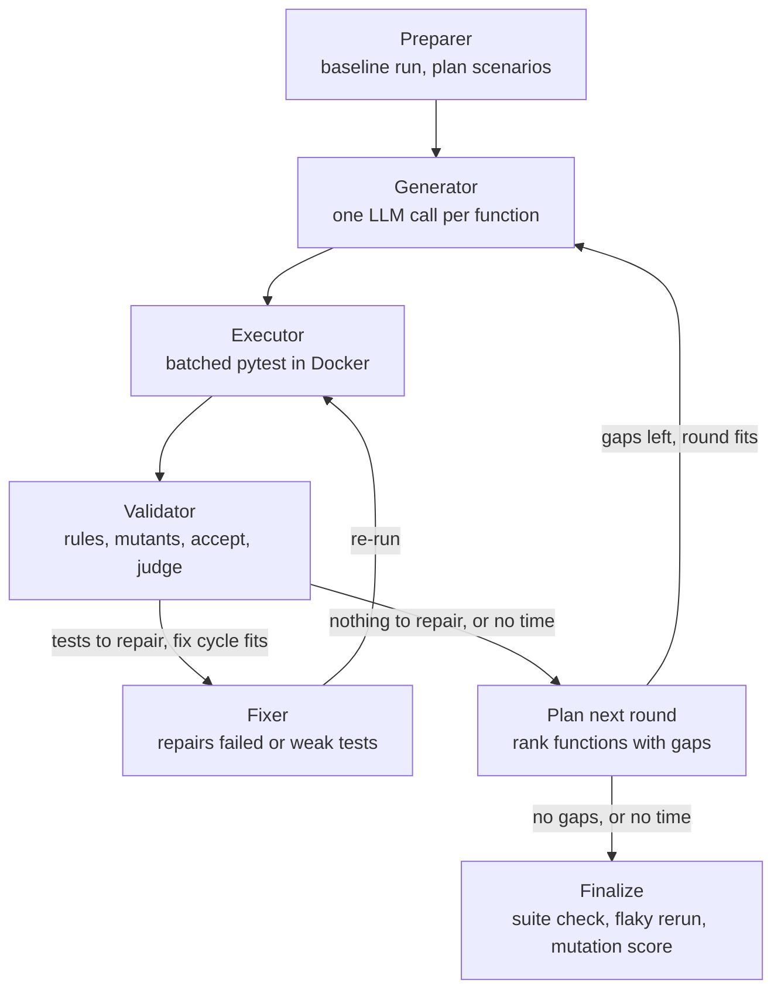

# AutoCover-Lite

A multi-agent Python test generator, modelled on Uber's AutoCover
([ICSE-SEIP 2026](https://homes.cs.washington.edu/~rjust/publ/auto_cover_icse_2026.pdf))
and scaled down to run on free-tier LLM APIs.

Five LangGraph agents (**Preparer → Generator → Executor → Validator → Fixer**) write pytest
tests for a module. A test is kept only if:
- it passes in an isolated Docker sandbox;
- it adds line or branch coverage **or** covers a previously untested scenario;
- it survives the quality gates: best-practice rules, plus mutation testing to catch weak
  assertions.

## Status

| Milestone | What | State |
|---|---|---|
| 1. Foundation | Config, LLM router, cache, telemetry, context retriever, mutator, splicer, Docker sandbox, CLI | ✅ done |
| 2. Happy path | Preparer → Generator → Executor graph with a line-coverage gate | ✅ done |
| 3. Quality loop | Validator (rules, mutation, scenario judge) + Fixer with rollback | ✅ done |
| 4. Scale & ops | Batched sandbox runs, budgets, flaky reruns, run reports | ✅ done |
| 5. Benchmark | 9 subjects vs a single-prompt baseline; `results.md` | ✅ done |
| 6. Shipping | GitHub Action that opens test PRs; architecture write-up | built (`action.yml`), not yet tried on a real PR |

## Benchmark

9 modules from pinned PyPI packages, with their own tests removed (3 basic, 3 medium, 3
hard), 15 minutes per module. Full table and charts: [`bench/results/results.md`](bench/results/results.md).

| Mean over 9 subjects | Single-prompt baseline | AutoCover-Lite |
|---|---|---|
| Line coverage | 80.9% | **92.8%** |
| Branch coverage | 72.4% | **88.4%** |
| Mutation score (identical 52-150 mutant pool) | 56.8% | **76.8%** |
| LLM calls | 3 | 72 |
| Wall time | 342s | 688s |

AutoCover-Lite is ahead on all three metrics on every subject. The mutation score gains most
(+20 points on average; +43 on dateutil, +36 on jmespath, +35 on slugify): the mutation
gate and the Fixer turn tests that merely *run* code into tests that *check* it. It is
weakest on the two largest modules: `tabulate` (886 statements in a few very long
functions: 58% lines, 37% mutation) and `boltons.iterutils` (mutation 64.0% -> 64.7%, where
planning hit its time cap and the Fixer had no time left).


How to read it fairly:

- **Not compute-matched.** AutoCover-Lite makes ~24x more LLM calls and takes ~2x the wall
  time. The baseline is the same model chain and test-writing rules in one call per
  module (median of 3 samples, failing tests dropped).
- **Same scorer for both.** Coverage comes from one plain run of each final suite, and
  every mutant of the identical seeded pool is run against it (`bench/rescore.py`).
  AutoCover-Lite's own mutation score, which reuses kills recorded during validation,
  matched the independent re-score on 8 of 9 subjects (iterutils: one mutant apart).
- **Measurement bug found, and fixed.** Per-test coverage counted physical lines
  (continuation and docstring lines) instead of statements, which understated
  AutoCover-Lite's own coverage numbers (dateutil: 57.9% reported, 100% real) and made
  acceptance credit noisy. The numbers above are re-measured; the runs themselves (8 on
  `48fedd5`, iterutils on the time-budget fixes) still accepted tests with the noisy
  credit.
- **Free tiers are shared state.** All subjects draw on one day's quotas, so later
  subjects get more fallback models, and each subject ran once, so there is no variance
  estimate.

## How a run works



1. **Preparer.** Runs the existing tests plus an import probe to get a baseline, asks an LLM
   for happy / edge / error *scenarios* per function, and ranks functions by uncovered lines.
2. **Generator.** Makes one LLM call per function for all of its open scenarios, and splits
   the reply into standalone single-test candidates. Later rounds get the lines that are still
   uncovered, the scenarios nobody has tested yet, and earlier failures.
3. **Executor.** Runs every candidate in its own Docker sandbox, in parallel, and records
   exactly the coverage it produced.
4. **Validator**, the quality gate:
   - **Rules** (`rules/best_practices.yaml`, checked on the AST):
     - no expected values computed with the code under test (taint-tracked);
     - no `autouse` fixtures;
     - no mocking of the module under test;
     - no introspection (`inspect`, `__defaults__`);
     - every test must assert something;
     - no sleep and no network.
   - **Mutation gate:** the test runs against *mutants* (small planted bugs) on the lines it
     executes. A test that kills none of them is a *weak oracle*.
   - **Acceptance** is greedy by *new signal*: new lines or branches, **or new mutants
     killed**. A test with neither can still be accepted if an LLM judge confirms it covers
     a scenario nobody has tested yet.
5. **Fixer.** Repairs failed and rejected tests, using the pytest output, the rule's fix
   instructions, or the surviving mutants. A weak test that adds coverage stays in the suite
   until a stronger repaired version *replaces* it. A test is frozen after 2 attempts.
6. **Finalize.**
   - ruff removes unused imports;
   - the merged suite runs as a whole, and tests that fail in combination are dropped;
   - the suite's **mutation score** is measured, and the surviving mutants are listed as
     "what is still untested".

```bash
autocover run examples/ticket_price ticket_price.py          # writes the test file
autocover run <repo> src/pkg/mod.py -f some_function --dry-run
```

On `examples/ticket_price`:

| | Milestone 2 (coverage gate) | Milestone 3 (quality loop) |
|---|---|---|
| Lines / branches | 100% / 100% | 100% / 100% |
| Mutation score | not measured (a `return 5 -> 6` bug went unnoticed) | **87.5%** (14/16) |
| Scenarios covered | 4/12 | **12/12** |
| Expected values computed with the code under test | kept | caught 4 times and rewritten as literals |
| Wall time | 22-168s | ~140s (1 round) |

The two surviving mutants are one real gap (no test of a 5+ group without a discount) and
one near-equivalent change (rounding to 3 decimals instead of 2).

## Operations

- **Batched sandbox runs with per-test coverage.** The runner switches coverage's dynamic
  context to each test's pytest node id, so one container can run a whole round of candidate
  files and still credit every line to the exact test. Mutation checks run once per mutant
  across every candidate it applies to. Safety nets:
  - a batch that times out falls back to one sandbox per candidate;
  - failures seen in a batch are confirmed in isolation.
- **Budgets.** Every run is limited by wall-clock time (`run.budget_min`), generation rounds,
  and an LLM budget (`run.max_llm_calls`, `max_llm_tokens`). Each run records why it
  stopped.
- **Flakiness defence.** The final suite is re-run (`run.flaky_reruns`), and any test that
  fails on a re-run is dropped.
- **Reports.** A run summary is saved to `.autocover/runs/<run_id>.json`. `autocover report`
  shows time by stage, sandbox work, LLM calls per role/model (with cache hits and fallback
  depth), and the candidate funnel.

Effect on `examples/ticket_price`, with the same results (100% lines and branches, 87.5%
mutation score, 12/12 scenarios) and cached LLM replies so only the pipeline is compared:

| | Before (milestone 3) | After (milestone 4) |
|---|---|---|
| Sandbox runs | 122 | 50 |
| Validator time | 93s | 47s |
| Final mutation score | 25s (16 runs) | 4s (14 known kills reused, 2 runs) |
| **Wall time** | **143s** | **71s** |

## What's built so far

| Component | File | Notes |
|---|---|---|
| LLM router | `src/autocover/llm/router.py` | Per-role fallback chains over free tiers. Each provider has a token bucket and a concurrency semaphore. Retryable errors get jittered exponential backoff, and each model has a circuit breaker. |
| Response cache | `src/autocover/llm/cache.py` | SQLite exact-match cache, so re-runs cost nothing. |
| Telemetry | `src/autocover/telemetry.py` | JSONL events carrying a run correlation id, plus OpenTelemetry spans sent to Jaeger. |
| Context retriever | `src/autocover/tools/context.py` | Import path, module imports, callee *signatures* and the class header, so prompts stay small. |
| Mutator | `src/autocover/tools/mutator.py` | Bounded AST mutation: arithmetic, comparison, boolean, `not`, constants, return values. The number of mutants is capped per function, with a seeded sample. |
| Splicer | `src/autocover/tools/splicer.py` | libcst merges tests without disturbing existing formatting. Imports are deduplicated, and name clashes are renamed deterministically (references included). |
| Sandbox | `src/autocover/tools/sandbox.py` | One Docker image per target repo. Each run gets its own container with `--network none`, memory/CPU/pid limits and a hard timeout, and reports per-test outcomes plus line/branch coverage. |

Models are chosen per role, pinned to exact versions, with 4-7 fallbacks each (full chains
in `config.yaml`):

| Role | Primary | Fallbacks, in order |
|---|---|---|
| Generator | GPT-OSS 120B (Ollama Cloud) | Gemini 3.5 Flash -> Gemini 2.5 Flash -> Nemotron 3 Super (Cloudflare) -> Codestral 2508 -> Nemotron 3 Super (NVIDIA NIM) |
| Fixer | GPT-OSS 120B (Ollama Cloud) | Gemini 3.5 Flash -> Nemotron 3 Super (Cloudflare) -> Codestral 2508 -> Nemotron 3 Super (NIM) |
| Preparer | Nemotron 3 Ultra (Ollama Cloud) | Nemotron 3 Ultra (NIM) -> Gemini 3.5 Flash -> GPT-OSS 120B (Groq) |
| Validator judge | GPT-OSS 20B (Groq) | Ministral 14B -> GPT-OSS 20B (Ollama) -> GPT-OSS 20B (Cloudflare) -> Gemini 3.5 Flash-Lite -> GLM-4.5-Flash |

Codestral sits ahead of NIM's Nemotron because, across the 9 benchmark subjects, NIM
averaged 30-60s per call (up to 150s) for a pass rate close to Codestral's 2-4s calls.

The Generator order comes from `bench/model_bakeoff.py` (one round per model on identical
cached scenarios; results in `bench/results/model_bakeoff.md`):

| Generator model | Tests passing | Coverage | Latency/call |
|---|---|---|---|
| Gemini 3.5 Flash | 100% | 100% | 7s |
| GPT-OSS 120B (Ollama) | 100% | 100% | 9s |
| Nemotron 3 Super (Cloudflare / Ollama / NIM) | 75% / 67% / 58% | 100% / 100% / 92% | 11s / 15s / 96s |
| Codestral 2508 | 53% | 92% | 5s |

That's one small module, so treat it as a first signal. Milestone 5 reruns it on 9 subjects.

The same model on several providers (Nemotron 3 Super on NVIDIA NIM, Ollama Cloud and
Cloudflare) gives independent quotas at one quality level. Gemini Flash sits late in every chain because the free tier
allows only **20 requests per day per Flash version**. NVIDIA NIM has no daily cap (~40 RPM
for the account).

Free tiers can use your prompts for training (Mistral's free plan requires opting in, and
Google does outside the EU/UK), so only point this tool at code you are allowed to share.

Free-tier quotas are metered **per model version**, so `config.yaml` pins versions (no
`-latest` aliases) and sets per-model `rpm` / `tpm` / `rpd` limits taken from each
provider's rate-limit headers. The router skips a model when:
- its daily cap is used up (tracked in `.autocover/usage.sqlite` per provider quota day;
  Gemini resets at midnight Pacific), or the provider has answered with a *daily-quota*
  429, which is never retried, or
- its limits would make a call wait longer than `max_queue_wait_s` (rate buckets,
  reservations by calls already queued, and the queue for the provider's concurrency
  slots). If *every* model would, the call queues on the one with the shortest expected
  wait.

`autocover usage` shows today's usage against each cap.

## Time budget

Free tiers fail slowly more often than they fail fast: queues grow, a provider degrades to
a minute or two per call, daily quotas run out mid-run. So the budget is enforced inside
the run, not only between rounds (`src/autocover/budget.py`):

| Where | Rule |
|---|---|
| Planning | At most 20% of the budget; functions still unplanned get a generic scenario |
| New round | Starts only if one as long as the last one still fits before the finalize reserve |
| New fix cycle | Starts only if one as long as the last one still fits |
| Generator / Fixer calls | Deadline = end of budget - finalize reserve - time to execute and mutation-check their tests |
| Judge calls | Deadline = end of budget - finalize reserve; a test not judged in time is rejected |
| Finalize reserve | Estimated: (suite run + reruns + one run per unkilled mutant, `max_parallel` at a time) x this run's typical sandbox time x 1.25 |

The router enforces a deadline itself: it skips models whose expected wait would miss it,
bounds queue waits and retry backoff by it, shortens the provider timeout to fit, and never
counts a deadline cut against a model's circuit breaker.

Problems the benchmark surfaced, each found in telemetry and fixed:

| Symptom | Cause | Fix |
|---|---|---|
| "Timeouts" that were not timeouts | Docker's Windows named pipe ran out of instances under parallel runs | At most 4 concurrent Docker API calls, status polling instead of a held `wait`, retries on pipe errors |
| Bursts of 429s | Concurrent callers all saw the same empty token bucket | Reservations, refunds of unused token estimates, queue-aware expected waits |
| A run spent minutes on one slow model | Degraded provider (NIM: up to 230s per call) | A timeout moves to the next model; planning capped at 20% of the budget |
| Cached replies made runs look fast | Benchmark reused the LLM cache | Fresh cache per benchmark run |
| Run took 2x its budget (iterutils, 1804s) | Quotas ran dry, and the last model in the judge chain (one call at a time, ~15s each) got every overflow call: 79 queued | Least-wait fallback, deadlines on every LLM call, estimated finalize reserve |

## Quickstart

Requires Python 3.11+ and Docker Desktop (WSL2 backend on Windows).

```bash
python -m venv .venv && .venv/Scripts/activate      # Windows; use bin/activate elsewhere
pip install -e ".[dev]"
cp .env.example .env                                # add the free API keys you have
autocover doctor                                    # checks keys, Docker, tracing
autocover llm-ping --role generator                 # one prompt through the fallback chain
```

Run hand-written tests through the sandbox and see coverage:

```bash
autocover sandbox-run examples/ticket_price ticket_price.py path/to/test_file.py
autocover mutants examples/ticket_price/ticket_price.py --function ticket_price
```

To view traces:

```bash
docker compose up -d jaeger
export OTEL_EXPORTER_OTLP_ENDPOINT=http://localhost:4318
# ...run a command, then open http://localhost:16686 (service: autocover-lite)
```

## Tests

```bash
pytest -q          # Docker sandbox tests run when an engine is reachable, else skip
ruff check src tests
```
