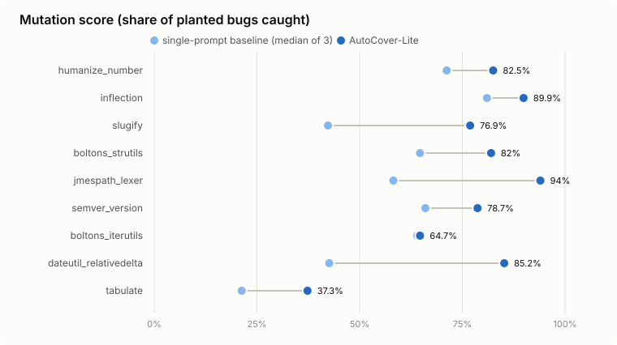
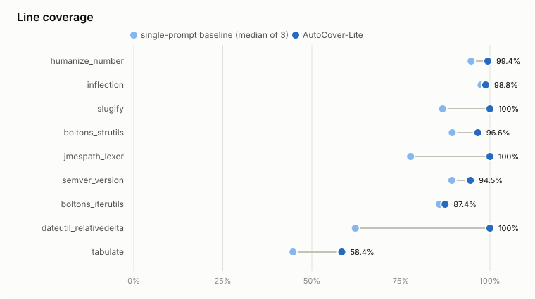

# Benchmark: AutoCover-Lite vs single-prompt baseline

Generated 2026-09-25 12:38 from `bench/results/runs/`. 9 of 9 subjects have results for both tools; AutoCover-Lite budget 15 min per subject.

## Headline (mean over subjects)

| | Baseline | AutoCover-Lite |
|---|---|---|
| Line coverage | 80.9% | 92.8% |
| Branch coverage | 72.4% | 88.4% |
| Mutation score | 56.8% | 76.8% |
| Tests kept | 24.7 | 57.2 |
| LLM calls | 3 | 72.3 |
| Wall time | 342.3s | 688.0s |

## Per subject

| Subject | Level | Lines B -> A | Branches B -> A | Mutation B -> A | Tests B (passing/generated) | Tests A | LLM calls B / A | Time B / A | Notes |
|---|---|---|---|---|---|---|---|---|---|
| humanize_number | basic | 94.7 -> **99.4** | 92.2 -> **98.4** | 71.2 -> **82.5** | 26/27 | 61 | 3 / 54 | 297s / 565s | 10 rounds, stopped: max rounds |
| inflection | basic | 97.5 -> **98.8** | 86.4 -> **95.5** | 81.0 -> **89.9** | 19/21 | 45 | 3 / 63 | 365s / 483s | 10 rounds, stopped: max rounds |
| slugify | basic | 86.7 -> **100.0** | 74.2 -> **95.5** | 42.3 -> **76.9** | 17/21 | 16 | 3 / 37 | 218s / 601s | 5 rounds, stopped: no gaps left |
| boltons_strutils | medium | 89.4 -> **96.6** | 82.1 -> **91.3** | 64.7 -> **82.0** | 31/34 | 105 | 3 / 129 | 422s / 786s | 1 rounds, stopped: time budget |
| jmespath_lexer | medium | 77.7 -> **100.0** | 79.3 -> **100.0** | 58.2 -> **94.0** | 12/21 | 22 | 3 / 34 | 208s / 640s | 4 rounds, stopped: no gaps left |
| semver_version | medium | 89.3 -> **94.5** | 77.1 -> **89.6** | 66.0 -> **78.7** | 15/16 | 81 | 3 / 95 | 380s / 741s | 1 rounds, stopped: time budget |
| boltons_iterutils | hard | 85.8 -> **87.4** | 76.6 -> **82.8** | 64.0 -> **64.7** | 78/82 | 101 | 3 / 94 | 472s / 773s | 1 rounds, stopped: time budget |
| dateutil_relativedelta | hard | 62.2 -> **100.0** | 55.4 -> **98.9** | 42.6 -> **85.2** | 15/20 | 60 | 3 / 88 | 282s / 716s | 3 rounds, stopped: no gaps left |
| tabulate | hard | 44.7 -> **58.4** | 28.0 -> **43.9** | 21.3 -> **37.3** | 9/12 | 24 | 3 / 57 | 437s / 887s | 2 rounds, stopped: time budget |

## AutoCover-Lite coverage within shorter budgets

Not shown for runs made before per-test coverage was counted in statements: their in-run curves also counted continuation and docstring lines, so they are not comparable with the final numbers.

## How to read this

- **Baseline**: the same Generator model chain and test-writing rules, one call for the whole module, failing tests dropped; the median of 3 samples is shown.
- **Mutation score**: both tools are scored on the identical seeded mutant pool (`mutation.max_mutants_per_function` / `max_mutants_total`), with every mutant run against the final suite (`bench/rescore.py` re-scores AutoCover-Lite this way instead of reusing kills recorded during validation).
- **Coverage**: both tools are measured from one plain run of the final suite (`coverage_rescored` for AutoCover-Lite runs recorded before the per-test statement fix, whose own percentages under-counted).
- **Caveats**: one AutoCover-Lite run per subject; free-tier models answer differently depending on quotas and load (see the models used in `bench/results/runs/*.json`); subjects are pinned wheel versions with their own tests removed.
