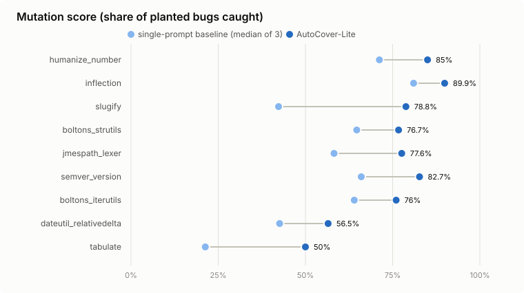
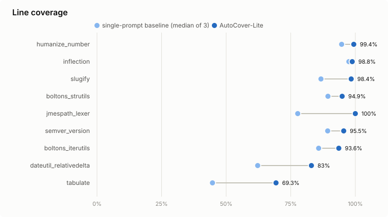
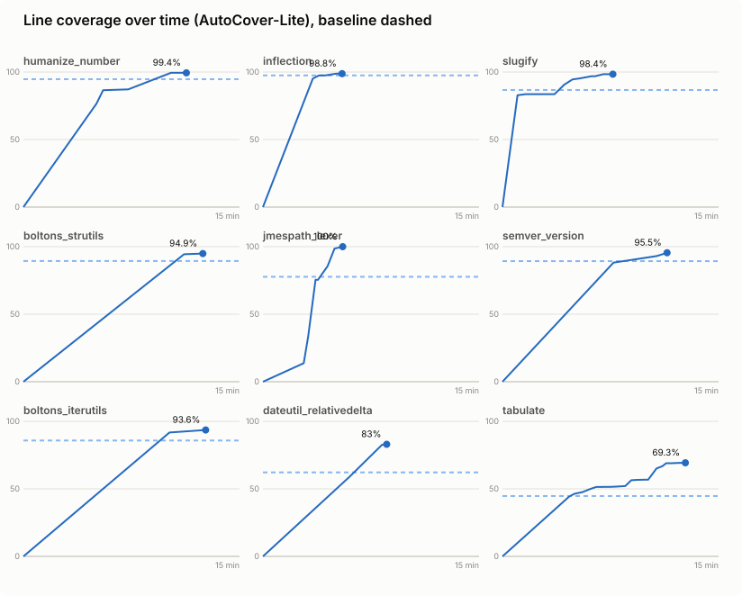

# Benchmark: AutoCover-Lite vs single-prompt baseline

Generated 2026-09-30 10:15 from `bench/results/runs/`. 9 of 9 subjects have results for both tools; AutoCover-Lite budget 15 min per subject.

## Headline (mean over subjects)

| | Baseline | AutoCover-Lite |
|---|---|---|
| Line coverage | 80.9% | 92.5% |
| Branch coverage | 72.4% | 87.5% |
| Mutation score | 56.8% | 74.8% |
| Tests kept | 24.7 | 67.3 |
| LLM calls | 3 | 86.3 |
| Wall time | 342.3s | 627.4s |

## Per subject

| Subject | Level | Lines B -> A | Branches B -> A | Mutation B -> A | Tests B (passing/generated) | Tests A | LLM calls B / A | Time B / A | Notes |
|---|---|---|---|---|---|---|---|---|---|
| humanize_number | basic | 94.7 -> **99.4** | 92.2 -> **98.4** | 71.2 -> **85.0** | 26/27 | 51 | 3 / 59 | 297s / 698s | 2 rounds, stopped: time budget |
| inflection | basic | 97.5 -> **98.8** | 86.4 -> **95.5** | 81.0 -> **89.9** | 19/21 | 74 | 3 / 85 | 365s / 354s | 10 rounds, stopped: max rounds |
| slugify | basic | 86.7 -> **98.4** | 74.2 -> **93.9** | 42.3 -> **78.8** | 17/21 | 27 | 3 / 28 | 218s / 479s | 10 rounds, stopped: max rounds |
| boltons_strutils | medium | 89.4 -> **94.9** | 82.1 -> **91.3** | 64.7 -> **76.7** | 31/34 | 127 | 3 / 137 | 422s / 798s | 1 rounds, stopped: time budget |
| jmespath_lexer | medium | 77.7 -> **100.0** | 79.3 -> **100.0** | 58.2 -> **77.6** | 12/21 | 13 | 3 / 12 | 208s / 365s | 3 rounds, stopped: no gaps left |
| semver_version | medium | 89.3 -> **95.5** | 77.1 -> **91.7** | 66.0 -> **82.7** | 15/16 | 123 | 3 / 190 | 380s / 732s | 1 rounds, stopped: time budget |
| boltons_iterutils | hard | 85.8 -> **93.6** | 76.6 -> **91.2** | 64.0 -> **76.0** | 78/82 | 117 | 3 / 121 | 472s / 803s | 1 rounds, stopped: time budget |
| dateutil_relativedelta | hard | 62.2 -> **83.0** | 55.4 -> **67.4** | 42.6 -> **56.5** | 15/20 | 38 | 3 / 74 | 282s / 568s | 1 rounds, stopped: time budget |
| tabulate | hard | 44.7 -> **69.3** | 28.0 -> **58.4** | 21.3 -> **50.0** | 9/12 | 36 | 3 / 71 | 437s / 850s | 7 rounds, stopped: time budget |

## AutoCover-Lite coverage within shorter budgets

Read off each run's coverage-over-time curve (the paper's Figure 2 method).

| Subject | 5 min | 10 min | 15 min | Final |
|---|---|---|---|---|
| humanize_number | 0.0% | 87.1% | 99.4% | 99.4% |
| inflection | 97.5% | 98.8% | 98.8% | 98.8% |
| slugify | 94.5% | 98.4% | 98.4% | 98.4% |
| boltons_strutils | 0.0% | 0.0% | 94.9% | 94.9% |
| jmespath_lexer | 98.6% | 100.0% | 100.0% | 100.0% |
| semver_version | 0.0% | 88.2% | 95.5% | 95.5% |
| boltons_iterutils | 0.0% | 0.0% | 93.6% | 93.6% |
| dateutil_relativedelta | 0.0% | 83.0% | 83.0% | 83.0% |
| tabulate | 46.3% | 56.8% | 69.3% | 69.3% |

## Models used by AutoCover-Lite (calls per role)

| Subject | Preparer | Generator | Fixer | Fixer (last attempt) | Judge |
|---|---|---|---|---|---|
| humanize_number | nim:nemotron-3-ultra 3, gemini:gemini-2.5-flash 2, ollama:nemotron-3-ultra 2, gemini:gemini-3.5-flash 1 | mistral:codestral-2508 5, cloudflare:nemotron-3-120b 5, ollama:gpt-oss:120b 4 | nim:nemotron-3-super-120b 8, ollama:gpt-oss:120b 5, mistral:codestral-2508 4 | ollama:gpt-oss:120b 2, gemini:gemini-3.5-flash 2 | groq:gpt-oss-20b 10, mistral:ministral-14b-2512 6 |
| inflection | gemini:gemini-2.5-flash 2 | mistral:codestral-2508 6, cloudflare:nemotron-3-120b 5, ollama:gpt-oss:120b 4 | mistral:codestral-2508 6, ollama:gpt-oss:120b 4 | gemini:gemini-2.5-flash 1 | groq:gpt-oss-20b 14, gemini:gemini-3.5-flash-lite 11, mistral:ministral-14b-2512 11, cloudflare:gpt-oss-20b 11, ollama:gpt-oss:20b 5, zai:glm-4.5-flash 5 |
| slugify | gemini:gemini-2.5-flash 1 | ollama:gpt-oss:120b 5 | mistral:codestral-2508 7, ollama:gpt-oss:120b 6, cloudflare:nemotron-3-120b 3 | ollama:gpt-oss:120b 3, mistral:codestral-2508 3 | - |
| boltons_strutils | nim:nemotron-3-ultra 8, groq:gpt-oss-120b 3, gemini:gemini-2.5-flash 2 | nim:nemotron-3-super-120b 19, mistral:codestral-2508 16, ollama:gpt-oss:120b 6 | mistral:codestral-2508 9, ollama:gpt-oss:120b 4, nim:nemotron-3-super-120b 4 | - | mistral:ministral-14b-2512 24, gemini:gemini-3.5-flash-lite 15, groq:gpt-oss-20b 13, ollama:gpt-oss:20b 7, zai:glm-4.5-flash 7 |
| jmespath_lexer | ollama:nemotron-3-ultra 1 | ollama:gpt-oss:120b 3 | ollama:gpt-oss:120b 4, mistral:codestral-2508 2 | gemini:gemini-2.5-flash 1 | mistral:ministral-14b-2512 1 |
| semver_version | nim:nemotron-3-ultra 6, gemini:gemini-3.5-flash 2, ollama:nemotron-3-ultra 2, groq:gpt-oss-120b 1 | nim:nemotron-3-super-120b 14, mistral:codestral-2508 9, cloudflare:nemotron-3-120b 9, ollama:gpt-oss:120b 5 | mistral:codestral-2508 28, nim:nemotron-3-super-120b 17, ollama:gpt-oss:120b 4 | mistral:codestral-2508 12, ollama:gpt-oss:120b 3, gemini:gemini-2.5-flash 1 | mistral:ministral-14b-2512 22, groq:gpt-oss-20b 17, gemini:gemini-3.5-flash-lite 13, cloudflare:gpt-oss-20b 13, ollama:gpt-oss:20b 6, zai:glm-4.5-flash 6 |
| boltons_iterutils | nim:nemotron-3-ultra 7, groq:gpt-oss-120b 6 | nim:nemotron-3-super-120b 25, mistral:codestral-2508 16, ollama:gpt-oss:120b 8 | mistral:codestral-2508 30, nim:nemotron-3-super-120b 5, ollama:gpt-oss:120b 2 | - | mistral:ministral-14b-2512 6, groq:gpt-oss-20b 5, gemini:gemini-3.5-flash-lite 5, ollama:gpt-oss:20b 3, zai:glm-4.5-flash 3 |
| dateutil_relativedelta | ollama:nemotron-3-ultra 1, nim:nemotron-3-ultra 1 | nim:nemotron-3-super-120b 8, mistral:codestral-2508 6, ollama:gpt-oss:120b 3 | mistral:codestral-2508 23, nim:nemotron-3-super-120b 9, ollama:gpt-oss:120b 1 | mistral:codestral-2508 9, ollama:gpt-oss:120b 1 | groq:gpt-oss-20b 6, mistral:ministral-14b-2512 5, ollama:gpt-oss:20b 1 |
| tabulate | nim:nemotron-3-ultra 3, ollama:nemotron-3-ultra 1 | ollama:gpt-oss:120b 10, mistral:codestral-2508 2 | mistral:codestral-2508 25, ollama:gpt-oss:120b 12 | ollama:gpt-oss:120b 9, mistral:codestral-2508 7, gemini:gemini-3.5-flash 2 | - |

Runs recorded before the role-aware quota strategy used no `fixer_final` chain.

## How to read this

- **Baseline**: the same Generator model chain and test-writing rules, one call for the whole module, failing tests dropped; the median of 3 samples is shown.
- **Mutation score**: both tools are scored on the identical seeded mutant pool (`mutation.max_mutants_per_function` / `max_mutants_total`), with every mutant run against the final suite (`bench/rescore.py` re-scores AutoCover-Lite this way instead of reusing kills recorded during validation).
- **Coverage**: both tools are measured from one plain run of the final suite (`coverage_rescored` for AutoCover-Lite runs recorded before the per-test statement fix, whose own percentages under-counted).
- **Caveats**: one AutoCover-Lite run per subject; free-tier models answer differently depending on quotas and load (see the models used in `bench/results/runs/*.json`); subjects are pinned wheel versions with their own tests removed.
